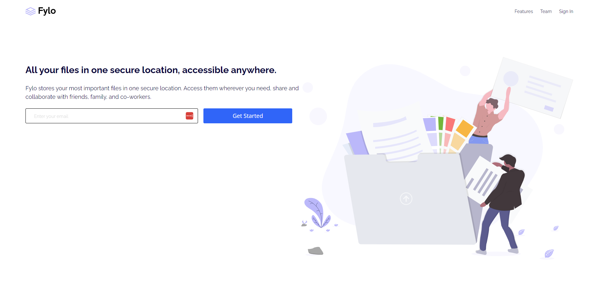
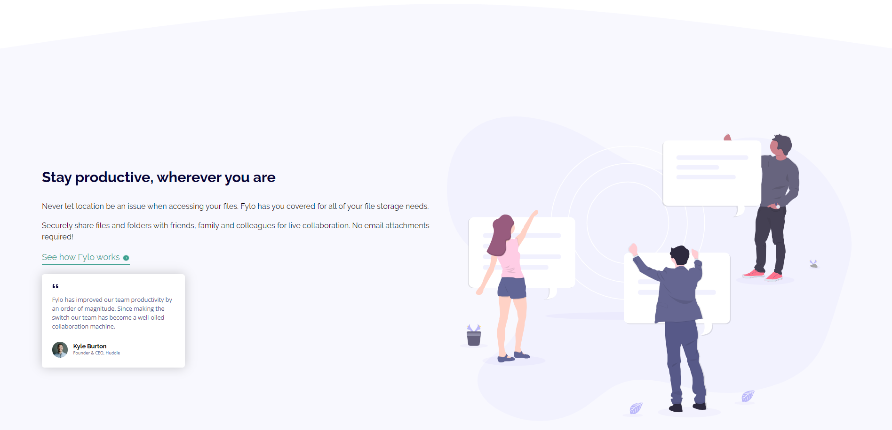
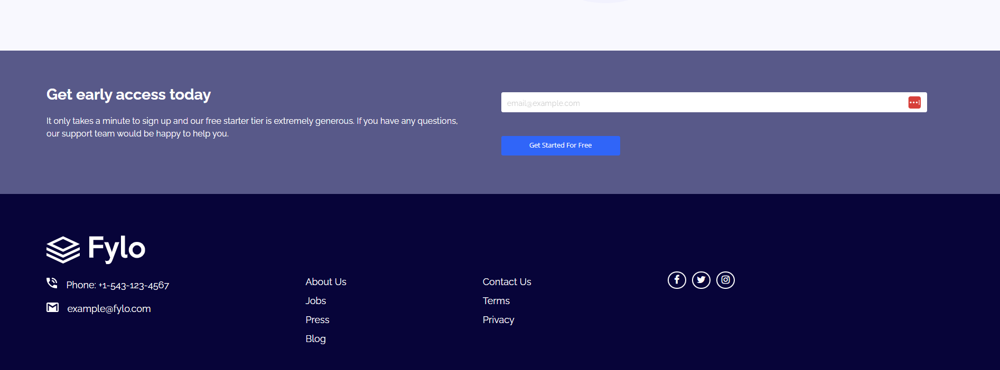

# 🚀 Fylo Landing Page with Two Column Layout – Frontend Mentor Challenge

> A modern, responsive landing page built as part of a Frontend Mentor challenge, focused on clean layout structure, responsive images, and performance-friendly design using only HTML and CSS.

📸 Preview  




---

## 👀 Why This Project Stands Out

- Built from an official **Frontend Mentor real-world challenge**
- Clean and modern **two-column landing page layout**
- Uses the `<picture>` element to **switch images based on device screen size**
- Optimized for **performance and responsiveness** without JavaScript
- Mobile-first approach with scalable desktop layouts
- Demonstrates strong understanding of **HTML structure and CSS architecture**

---

## 🛠️ Tech Stack

- **HTML5** – Semantic, accessible markup  
- **CSS3** – Flexbox, media queries, CSS variables  
- **Responsive Images** – `<picture>` and `srcset` for device-based image switching  
- **Google Fonts** – Raleway & Open Sans  
- **Font Awesome** – Social media icons  
- **Frontend Mentor Design Assets**

---

## ✨ Features

- Fully responsive layout (mobile, tablet, desktop)
- Two-column desktop design with mobile-first structure
- Responsive background curve using SVG images
- Device-specific images for better performance
- Newsletter and early-access forms
- Testimonial card with clean visual hierarchy
- CSS hover and active states for interactive elements
- No JavaScript required

---

## 🧠 What I Learned

- How to **switch images based on screen size** using the `<picture>` element
- Structuring HTML for **scalable, responsive layouts**
- Building modern landing pages with **Flexbox**
- Writing **clean, maintainable CSS** with variables
- Managing complex layouts across breakpoints
- Improving **performance** by serving optimized assets
- Translating a design mockup into a polished, production-ready UI

> 📌 This project was especially valuable for learning how to serve different images depending on device size, improving both performance and user experience without relying on JavaScript.

---

## ⚙️ How to Run Locally

1. Clone the repository  
   ```bash
   git clone https://github.com/FrontEndHighRoller/fylo-landing-page.git
2. Open index.html in your browser
3. Resize the screen to see responsive layouts and image switching in action 🎯

---

🏆 Challenge Credit
Challenge by Frontend Mentor
https://www.frontendmentor.io

---

🙋‍♂️ Author
Dennis Rumanek

GitHub: https://github.com/FrontEndHighRoller

LinkedIn: https://www.linkedin.com/in/dennis-rumanek/

⭐ If you like this solution, feel free to star the repository!
